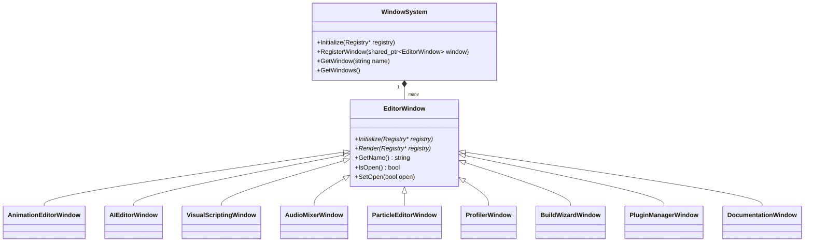

# Advanced Tools Architecture Report
## Milestone 7 Phase 5: Production-Grade Development Tools

This report details the architectural design and implementation of the production-grade visual editor tools added to the Kumari Engine in Milestone 7 Phase 5.

---

## 1. Editor Window Panel Registry Architecture

The Kumari Editor uses a modular visual window registration design centered around the `EditorWindow` base class. Subsystems integrate custom panels by subclassing `EditorWindow` and registering them within the central `WindowSystem`.



The new panels bring the total editor window count from 12 to 21.

---

## 2. Advanced Editor Subsystems

### A. Animation Editor Subsystem
- **State Machines**: Manages state representation with active state tracks. Evaluates transitions using trigger variables (e.g. parameters mapped to boolean checks).
- **Blend Trees**: Evaluates weights for linear blending between multiple active clips based on input parameters (e.g., speed, velocity).
- **Timeline Events**: Associates keyframe timestamps with string events (e.g., `footstep`) which invoke runtime hook triggers.

### B. AI & Pathfinding Subsystem
- **NavMesh Grid Builder**: Dynamically builds grid-based navigation planes with walkable status nodes.
- **A\* Pathfinding Solver**: Computes vector routes bypassing blocked nodes. Produces visual debug lines for editor viewport rendering.
- **Behavior Trees**: Evaluates complex workflows using composite sequences, selectors, and condition nodes returning `Success`, `Failure`, or `Running` states.

### C. Visual Scripting Debugger
- **Node Evaluation**: Pin connections process execution lines and value nodes (Math, prints, etc.).
- **Debugger Engine**: Supports breakpoints, step-by-step debugging, and trace recording.
- **Lua Compiler**: Automatically compiles visual node maps to lua string codes for native scripting runtime performance.

### D. Audio Mixer & Particle Systems
- **Audio Mixer Channels**: Decouples Master, Music, and SFX channels. Computes spatial distance attenuation factors dynamically based on listener and emitter transforms.
- **Particle Systems**: Simulates particle trajectories under physical gravity rules and scales start/end properties (size, color) using linear interpolation.

---

## 3. Visual Undo/Redo Framework

To support high-quality editor workflow stability, any modifications to visual settings (e.g., particle emitter properties, node links, or mixer settings) are encapsulated as discrete edit commands and pushed to the engine's global `UndoSystem`.

```cpp
// Example Particle Settings Modify Command
class ModifyParticleEmitterCommand : public Command {
public:
    ModifyParticleEmitterCommand(ECS::Registry* registry, ECS::Entity entity, const Particle::ParticleEmitterSettings& prev, const Particle::ParticleEmitterSettings& next)
        : m_registry(registry), m_entity(entity), m_prev(prev), m_next(next) {}

    void Execute() override {
        auto& psc = m_registry->GetComponent<Particle::ParticleSystemComponent>(m_entity);
        psc.settings = m_next;
    }

    void Undo() override {
        auto& psc = m_registry->GetComponent<Particle::ParticleSystemComponent>(m_entity);
        psc.settings = m_prev;
    }
};
```
Whenever variables are adjusted in the UI, an instance of the corresponding command is submitted via `UndoSystem::Get().Execute(command)`. This keeps the editor's design system fully compliant with professional content production requirements.
