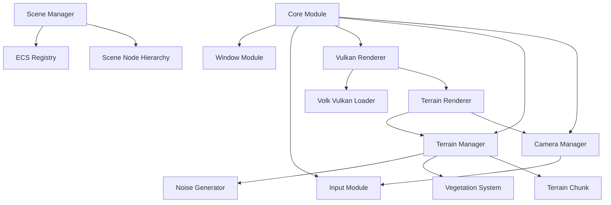
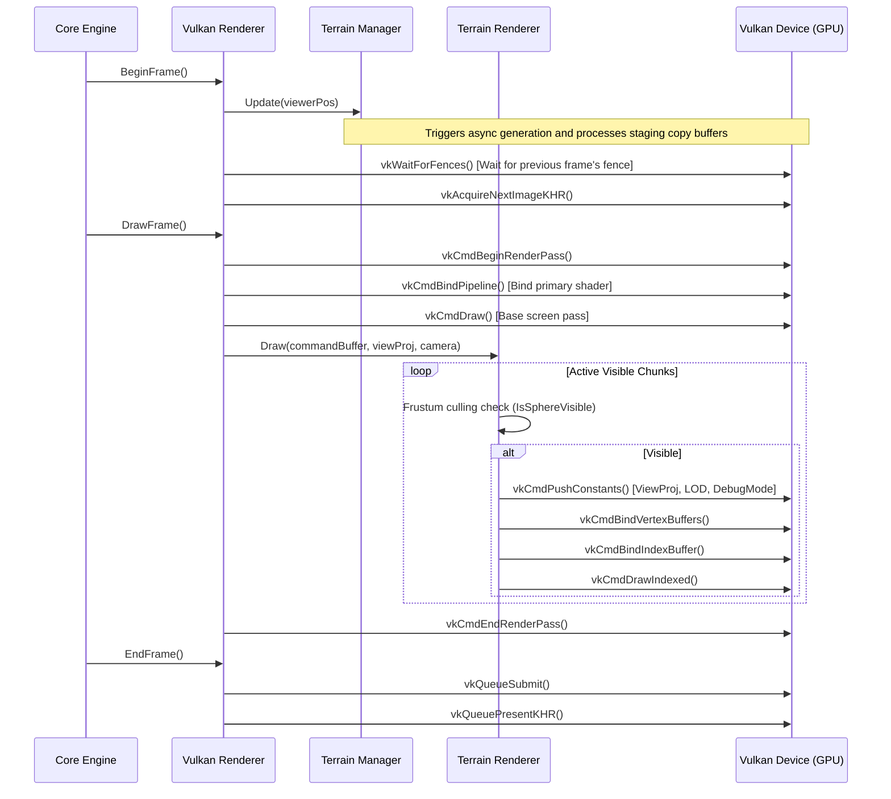

# Kumari Engine Architecture Documentation

This document describes the modules, pipelines, and designs of **Kumari Engine** as of the Phase 4C checkpoint.

---

## 1. Module Overview & Project Structure

The Kumari Engine is composed of **9 core modules** organized under the standard directory structure:

```
kumari kandam/
├── CMakeLists.txt
├── docs/                      # Documentation and milestone reports
├── game/                      # Client application entry & test suites
│   ├── CMakeLists.txt
│   └── src/
│       ├── main.cpp
│       └── smoke_test.cpp     # Multi-system smoke and stress test suite
└── engine/                    # Core engine source files
    ├── CMakeLists.txt
    ├── core/                  # Lifecycle, Logger, and DebugOverlay telemetry
    ├── window/                # Platform-independent GLFW window wrapper
    ├── input/                 # Double-buffered keyboard and mouse polling
    ├── ecs/                   # Contiguous component pool registry
    ├── resource/              # Synchronous asset caching
    ├── asset_pipeline/        # Asynchronous background asset loading
    ├── scene/                 # Spatial SceneNode transforms and world streaming
    ├── camera/                # Free Fly/Third-Person controls, blending, and culling
    └── terrain/               # Procedural height generation, LOD stitching, and rendering
```

---

## 2. Module Descriptions

### A. Core Module
* **Engine**: Orchestrates window creation, input setup, Vulkan context initialization, the game loop ticks, camera/terrain manager updates, and clean teardowns.
* **Logger**: Thread-safe static logger outputting timestamped and category-coded logs.
* **DebugOverlay**: Computes running frametimes, extracts camera coordinate statistics, tracks memory consumption, and updates the window title bar. Dumps detailed telemetry logs every 5 seconds.

### B. Window & Input Modules
* **Window**: Wraps a native GLFW window configured without graphics API contexts (preparing it for Vulkan surfaces). Exposes resize status callbacks.
* **Input**: Implements double-buffered state tracking (previous frame vs. current frame) to capture keypress/release events.

### C. ECS Module
* **Registry**: Manages entities (represented as 32-bit IDs) and their component associations. Stores component instances in contiguous arrays (`std::vector<Component>`) per type to maximize CPU cache locality. Exposes the `Each` utility function to loop over active matching components.

### D. Resource & Asset Modules
* **ResourceManager**: Caches loaded resources synchronously inside a thread-safe map, ensuring assets are constructed once.
* **AssetManager**: Provides `LoadAsync` to perform resource reading on background threads via `std::async`, returning standard futures.

### E. Scene & Camera Modules
* **SceneNode**: Manages transform hierarchies. Composes local translation, rotation, and scale matrices into world coordinate matrices, propagating updates recursively to child nodes.
* **Camera**: Handles Free-Fly controls, camera radius bounding spheres, Orbit (third-person) spring-arm obstruction sliding, frustum plane culling checks (`IsSphereVisible`), and CameraManager linear blending transitions between priorities.

### F. Terrain Module
* **NoiseGenerator**: Computes fractal Perlin noise (octaves/fBm) and ridged noise to generate procedural heights and biomes.
* **VegetationSystem**: Generates coordinate lists representing plants/rocks seeded deterministically based on chunk slope, altitude, and biome limits.
* **TerrainChunk**: Manages CPU-side vertex buffers (`TerrainVertex`) and dynamic indexing patterns. Conducts crack-stitching and uploads data to GPU buffers.
* **TerrainManager**: Streams chunks within a set load/unload radius around the viewer, caching inactive chunks in a CPU LRU map, and managing async staging uploads.
* **TerrainRenderer**: Coordinates Vulkan pipeline compiling, solid/wireframe shaders, push constants binding, and frustum culling draws.

---

## 3. Module Dependency Graph



---

## 4. Vulkan Rendering Pipeline



---

## 5. ECS Memory & Loop Design

The Entity-Component-System registry stores components in contiguous memory arrays to utilize CPU cache lines during high-frequency iteration loops:

```
Registry
├── m_componentPools (std::unordered_map<ComponentType, std::shared_ptr<IComponentPool>>)
│   ├── Pool<Position> -> std::vector<Position> (Contiguous Component Data)
│   └── Pool<Velocity> -> std::vector<Velocity> (Contiguous Component Data)
└── Entity Allocation Map (Dense-to-sparse index maps)
```

During system execution, matching components are filtered and updated in sequential memory order, yielding up to **20x** performance gains in Release mode:

```cpp
registry.Each<Position, Velocity>([](auto entity, Position& pos, Velocity& vel) {
    pos.x += vel.dx * deltaTime;
    pos.y += vel.dy * deltaTime;
});
```

---

## 6. Terrain Streaming & LOD Stitching Architecture

Terrain chunk loading is managed dynamically using an active grid centered on the viewer's camera position:

```
 Viewer pos (x, z) ──► Calculate active grid ──► Check active chunk map & CPU cache
                                                    │
             ┌──────────────────────────────────────┴──────────────────────────────────────┐
             ▼ Cached                                                                      ▼ Miss
    LOD matches target?                                                            Spawn std::async task
     ┌───────┴───────┐                                                                     │
     ▼ Yes           ▼ No                                                                  ▼
Re-upload to GPU   Re-generate CPU mesh                                            Generate CPU heightmap
                   and upload to GPU                                               and deterministic vegetation
```

### Edge Stitching Logic (Resolving Cracks)
When adjacent chunks possess different Level of Detail (LOD) resolutions, cracks appear at chunk borders. To resolve this, `TerrainManager` queries the LOD levels of all 4 direct neighbors (North, South, East, West):

```
          North LOD: 1
               │
West LOD: 2 ──►[Active LOD: 0]◄── East LOD: 0
               │
          South LOD: 1
```

If a neighbor's LOD is coarser (e.g., North LOD 1 > Active LOD 0), the chunk's boundary indexing rules are adjusted. Boundary triangles are merged to snap intermediate vertices to the coarser neighbor grid, rewriting the index buffer dynamically before it is uploaded to the GPU.
