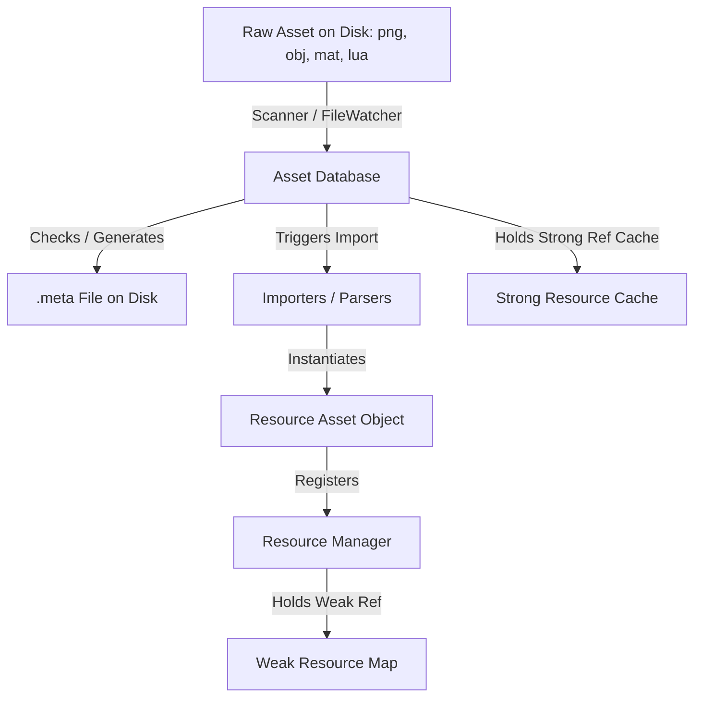

# Asset Pipeline Architecture Report

This report documents the architecture, data structures, and lifecycle of the Kumari Engine Asset Pipeline implemented in Milestone 7 Phase 3.

## 1. Design Overview
The asset pipeline provides stable asset referencing, asset importing, dependency tracking, and live file monitoring. It separates source assets (on disk) from engine-ready resource objects (in memory), establishing robust mechanisms suitable for production development, modding, and long-term versioning.

## 2. Component breakdown

### 2.1 Asset Database (`AssetDatabase`)
The `AssetDatabase` is a singleton mapping stable 32-character hexadecimal GUIDs to relative file paths.
- **Scanning**: Initiates directory walks over the `Assets/` directory. Unregistered files trigger GUID and metadata generation.
- **Meta Files (`.meta`)**: Every asset has a corresponding `.meta` file containing the `guid`, `type`, `dependencies`, and type-specific `importerSettings`.
- **Rename & Move Detection**: On startup or scan, missing registered files are cross-referenced against new untracked files by file extension and size. If a match occurs, the `.meta` file is moved automatically to the new location to preserve GUID stability.

### 2.2 Asset Import Pipeline
Importers convert raw file formats into engine-ready objects:
- **Texture**: Raw image types (`.png`, `.jpg`, `.jpeg`, `.tga`) load and allocate raw pixel buffers.
- **Model**: Parses `.obj` lines containing vertices (`v`), textures (`vt`), normals (`vn`), and faces (`f`) into a contiguous vertex/index array structure.
- **Material**: Key-value parser maps shader parameters (color, metallic, roughness) and extracts albedo texture GUIDs to register material-to-texture dependencies.
- **Audio & Font**: Validates parameters and caches buffers.
- **Lua Script**: Reads source files and checks for dependencies by tracking `require("path")` expressions.

### 2.3 Dependency Graph
Maintains bidirectional relationships (`guid -> dependencies` and `guid -> referencers`).
- **Validations**: Automatically reports broken references if any target GUID is deleted from disk.
- **Auto-Recovery**: Allows replacing a missing asset GUID with a new GUID, automatically rewriting referencing materials, scene nodes, and script metadata.

### 2.4 Live Reimport & File Watching
A directory `FileWatcher` tracks OS file modification, addition, and deletion events in real-time. Upon changes, the pipeline:
1. Reloads the resource from the raw source file.
2. In-place updates the resource instance inside the cache and `ResourceManager`.
3. Triggers hot-reloading (e.g. `ScriptEngine` re-running the Lua script environment).
