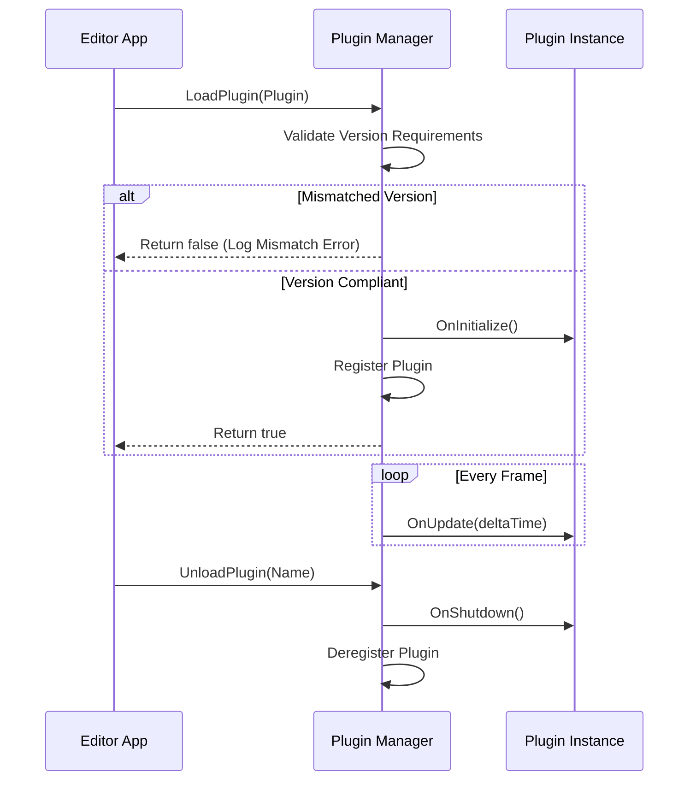

# Plugin Framework Report
## Milestone 7 Phase 5: Modular Extensibility & Documentation

This report describes the architecture and integration of the Kumari Engine Plugin System, which allows developers to build custom engine/editor modifications and query internal API databases.

---

## 1. Plugin Lifecycle & Dynamic Loading

The `PluginManager` acts as the main hub for third-party extensions. Extensions subclass the base `Plugin` class and are dynamically loaded and initialized at runtime.

### Loading Lifecycle
1. **Discovery & Registration**: Plugins are passed to `LoadPlugin(std::shared_ptr<Plugin> plugin)`.
2. **Compatibility Validation**:
   - The engine validates version compatibility:
     $$\text{Engine Version} \geq \text{Plugin Required Engine Version}$$
   - Mismatches immediately trigger an error log and abort initialization.
3. **Initialization Hook**: If validated, `OnInitialize()` is triggered.
4. **Execution Loop**: Every frame, the plugin's `OnUpdate(dt)` is evaluated.
5. **Shutdown Hook**: When a plugin is unloaded, `OnShutdown()` is called to clean up allocated handles.



---

## 2. API Documentation Parser & Help System

To support rapid custom tool development, the editor compiles API symbol databases. The `DocumentationWindow` parses this database to expose in-editor search capabilities.

- **Markdown Export**: Generates readable documents summarizing internal classes.
- **Dynamic Search Database**: Exposes query routing for developer lookups (e.g. searching "ecs" returns `ECS::Registry` details).

```cpp
// Example API query implementation
std::string DocumentationWindow::SearchHelpDatabase(const std::string& query) {
    std::string lowerQuery = query;
    std::transform(lowerQuery.begin(), lowerQuery.end(), lowerQuery.begin(), ::tolower);

    std::stringstream results;
    bool found = false;
    for (const auto& [symbol, text] : m_apiDatabase) {
        std::string lowerSymbol = symbol;
        std::transform(lowerSymbol.begin(), lowerSymbol.end(), lowerSymbol.begin(), ::tolower);
        if (lowerSymbol.find(lowerQuery) != std::string::npos) {
            results << "### " << symbol << "\n" << text << "\n\n";
            found = true;
        }
    }
    return found ? results.str() : "No documentation entries found matching query: " + query;
}
```
This ensures developers have access to immediate assistance without needing to leave the editor workspace.
