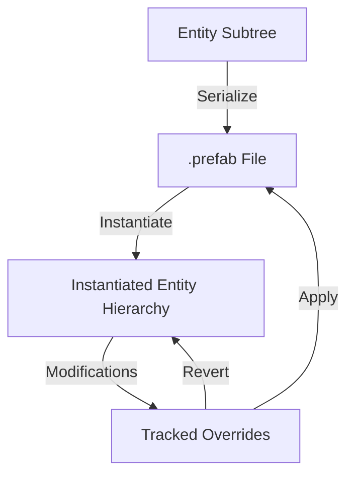

# Prefab System Design Report

This report documents the design, override-tracking mechanisms, and serialization format of the Kumari Engine Prefab System implemented in Milestone 7 Phase 3.

## 1. Design Overview
The prefab system allows developers to save sub-trees of the scene hierarchy as reusable templates. When instantiated in a scene, these entities maintain a link to their source prefab GUID, allowing default properties to be inherited while tracking local overrides.

## 2. Component breakdown

### 2.1 Prefab Instance Component (`PrefabInstanceComponent`)
Attached to all entities in an instantiated prefab.
- `prefabAssetGuid`: GUID referencing the source `.prefab` file.
- `prefabEntityId`: Original stable entity GUID within the prefab's definition.
- `isRoot`: Boolean marking the local root of the prefab hierarchy.
- `overrides`: Vector of `PrefabOverride` structures detailing type-specific modifications.

### 2.2 Nested Prefabs
Prefabs can contain child entities that are themselves instances of another prefab.
- **Serialization**: When saving a prefab, child entities with `PrefabInstanceComponent` and `isRoot = true` (nested prefabs) are serialized along with their override definitions. The nested prefab's own child entities are *not* duplicated in the parent prefab file.
- **Instantiation**: Upon loading a nested prefab, the system recursively instantiates the referenced sub-prefabs and overlays any stored overrides, achieving nested hierarchy resolution.

### 2.3 Prefab Variants
Variants are prefabs that inherit from a parent base prefab but specify a persistent set of overrides.
- **Inheritance**: Creating a variant instantiates the base prefab, applies a custom override payload, and serializes the modified instance to a new `.prefab` file.

### 2.4 Override Tracking & Actions
- **Track Override**: Changes to component fields can be tracked.
- **Apply Overrides**: Saves the current instance hierarchy back to the `.prefab` file on disk. During save, it writes the original `prefabEntityId` values to preserve GUID mappings in the prefab definition. The modifications are immediately propagated to all other active instances of the prefab in the scene.
- **Revert Overrides**: Reverts all changes back to the prefab's defaults. To ensure correctness without writing custom rollback logic for every component, the system deletes the overridden sub-tree and clean-reinstantiates the prefab in-place.
