# Profiling & Diagnostics System Report
## Milestone 7 Phase 5: Debugging, Timings & Memory Captures

This report covers the architecture of the Kumari Engine Profiler and diagnostic capturing systems.

---

## 1. Timing Analysis: CPU & GPU Probes

The profiler tracks sub-millisecond execution times for key hot code paths.

- **CPU Profiling Probes**:
  - Encapsulated via the `PROFILE_SCOPE(name)` RAII macro.
  - Automatically pushes timing samples to the profiler history on scope exit.
- **GPU Profiler Stages**:
  - Leverages hardware timestamp structures (mocked in testing) to trace GPU execution blocks (e.g. `VulkanPostProcess`).

```mermaid
gantt
    title Frame Timing Trace Example
    dateFormat  X
    axisFormat %s
    section CPU Loop
    Frame Update : active, 0, 10
    Physics Tick : active, 1, 4
    Render Queue : active, 4, 9
    section GPU Stage
    Vulkan Render Pass : active, 5, 12
    Vulkan PostProcess : active, 12, 15
```



---

## 2. Categorized Memory Tracking

To debug and eliminate memory leaks during runtime, the profiler tracks allocations across separate engine boundaries:

```cpp
enum class MemoryCategory {
    ECS,
    Physics,
    Renderer,
    Audio,
    Lua,
    General
};
```

Whenever an engine system allocates or deallocates memory, it updates the profiler counters:
```cpp
void Profiler::TrackAllocation(MemoryCategory category, size_t size) {
    m_memoryAllocations[category] += size;
}

void Profiler::TrackDeallocation(MemoryCategory category, size_t size) {
    auto& alloc = m_memoryAllocations[category];
    if (alloc >= size) {
        alloc -= size;
    } else {
        alloc = 0; // Prevent unsigned underflow
    }
}
```

---

## 3. Diagnostic Frame Captures

The profiler allows developers to execute snapshot captures. When `CaptureFrame(filename, registry)` is invoked, it serializes:
- **System Memory Totals**: Summarizes categorized allocation pools.
- **CPU Time Spans**: Includes average timing statistics for registered scopes.
- **Vulkan / GPU Timestamps**: Outputs active rendering timings.
- **ECS Registry Metrics**: Logs active entity counts and component registration metrics.

The diagnostic file is saved in a human-readable format, making it easy to share traces for debugging or post-mortem analysis.
